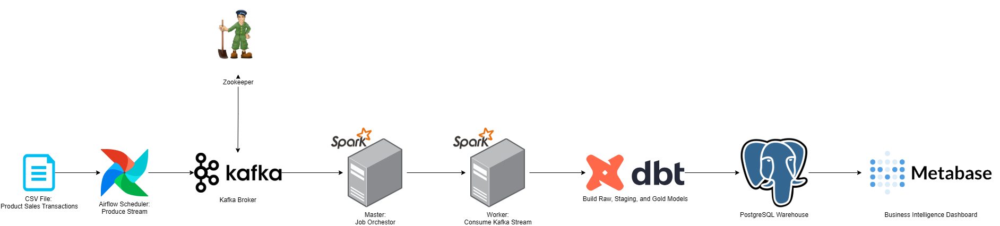

# Retail Sales Streaming Pipeline
[](LICENSE)


A containerized, streaming data pipeline that ingests, processes, stores, and visualizes real-time retail sales events using Kafka, Airflow, Spark, Postgres, and Metabase. Designed for local development and easy deployment via Docker Compose.


## Problem Statement
Retail businesses often need to monitor and analyze transactions in real time to identify sales trends, detect anomalies, and optimize inventory. Traditional ETL processes are batch-oriented and introduce latency between data creation and actionable insights. This project demonstrates a real-time streaming architecture where retail sales data is produced, processed, and visualized with minimal delay.


## Features

- **Event-Driven Architecture**: Kafka topics as the backbone for real-time data movement
- **Automated Orchestration** with Apache Airflow to schedule and trigger data flows
- **Stream Processing** using PySpark Structured Streaming
- **Persistent Storage** in PostgreSQL for downstream analysis
- **Interactive Dashboard** in Metabase for quick visual insights
- **Fully containerized** stack using Docker Compose for easy local deployment


## Live Dashboard Preview
  
_Metabase dashboard displaying real-time aggregated retail sales from the streaming pipeline._


## Tech Stack

**Streaming:** Apache Kafka  
**Orchestration:** Apache Airflow  
**Processing:** Apache Spark (Structured Streaming)  
**Database:** PostgreSQL  
**Visualization:** Metabase  
**Infrastructure:** Docker Compose  
**Language:** Python (pyspark, kafka-python, psycopg2)  


## Components

| Layer            | Technology                  | Description |
|------------------|-----------------------------|-------------|
| **Data Source**   | CSV file (sample retail sales) | Synthetic dataset simulating live transactions |
| **Ingestion**     | Airflow DAG (`kafka_stream.py`) | Publishes CSV rows as JSON messages to Kafka topic `sales` |
| **Stream Processing** | Spark Structured Streaming | Consumes Kafka messages, parses JSON, and writes to Postgres |
| **Storage**       | PostgreSQL                  | Stores processed transactions in `raw_transactions` table |
| **Visualization** | Metabase                    | Interactive SQL-based dashboards over PostgreSQL data |


## Architecture Flow (Step-by-Step)

  

1. **Data Ingestion**  
   Airflow DAG reads from a CSV and streams transaction records into Kafka topic `sales`.

2. **Stream Processing**  
   A Spark Structured Streaming job consumes messages from Kafka, transforms them, and writes the transformed messages into PostgreSQL.

3. **Visualization**  
   Metabase queries PostgreSQL in near real-time to provide dashboards and charts.


## Key Learnings
- Designed an event-driven streaming pipeline for real-time analytics
- Integrated Kafka, Airflow, Spark, Postgres, and Metabase in a cohesive local stack
- Used Spark Structured Streaming for low-latency ingestion into a relational database
- Leveraged Docker Compose for reproducible deployments


## Try It Yourself

```bash
# Clone repository
git clone https://github.com/nakuleshj/retail-sales-pipeline
cd retail-sales-pipeline

# Run the stack
chmod +x run_pipeline.sh
./run_pipeline.sh
```

Access the UIs:
- Airflow: [http://localhost:8080](http://localhost:8080)
- Metabase: [http://localhost:3000](http://localhost:3000)
- pgAdmin: [http://localhost:5050](http://localhost:5050)
- Spark UI: [http://localhost:9090](http://localhost:9090)


## Future Improvements
- Add dbt transformations for analytics-ready models
- Implement real-time anomaly detection on transaction data
- Deploy pipeline to cloud-native services (AWS MSK, EMR, RDS, QuickSight)


## License
This project is licensed under the [MIT License](LICENSE).  
Feel free to use, modify, and share with attribution.
