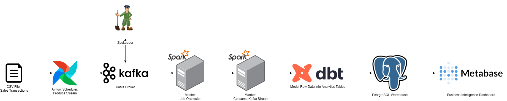

# Real-Time Retail Sales Streaming Pipeline

A fully containerized, event-driven data pipeline that ingests, processes, models, and visualizes real-time retail sales data using open-source tools. Built with Kafka, Spark, dbt, PostgreSQL, and Metabase — this pipeline demonstrates a modern data architecture with real-time streaming and SQL-based transformations.


## Problem Statement

Retail businesses generate large volumes of transactional data that can be leveraged for real-time analytics, inventory management, and demand forecasting. However, most pipelines are batch-oriented and lack scalability. This project introduces a **streaming-first architecture** to continuously ingest and transform sales data, enabling business stakeholders to monitor performance in real-time.


## Features

- **Apache Kafka** for real-time data ingestion and delivery
- **Spark Structured Streaming** to consume, parse, and clean Kafka streams
- **PostgreSQL** as the centralized warehouse for modeled data
- **dbt** to create raw and analytics-ready (gold) tables
- **Metabase** for interactive dashboarding and insights
- **Airflow** for scheduled ingestion and orchestration of the pipeline
- **Docker Compose** to orchestrate all services locally with ease


## Tech Stack

| Layer | Tool(s) |
|-------|--------|
| **Orchestration** | Apache Airflow |
| **Streaming & Messaging** | Apache Kafka, Zookeeper |
| **Processing Engine** | Apache Spark (Structured Streaming) |
| **Transformation** | dbt (Data Build Tool) |
| **Storage / Warehouse** | PostgreSQL |
| **Dashboarding** | Metabase |
| **Containerization** | Docker Compose |


## Architecture Overview

  
_Horizontal layered pipeline with Kafka → Spark → dbt → PostgreSQL → Metabase._

### Data Flow:

1. **Airflow** triggers a sales data producer that sends JSON records to **Kafka topics**.
2. **Spark Structured Streaming** jobs consume the Kafka stream, apply transformations (e.g., type casting, timestamping), and write to **PostgreSQL**.
3. **dbt** models raw tables into analytics-ready gold models (e.g., daily sales, top products).
4. **Metabase** connects to PostgreSQL to visualize real-time insights.


## Pipeline Components

| Stage | Tool | Role |
|-------|------|------|
| **Ingestion** | Kafka + Airflow | Produces simulated retail sales events into Kafka topics |
| **Processing** | Spark | Reads from Kafka, applies real-time transformations, writes to PostgreSQL |
| **Transformation** | dbt | Builds raw → analytics-ready models inside PostgreSQL |
| **Storage** | PostgreSQL | Serves as the central warehouse |
| **Analytics** | Metabase | BI layer for dashboards and exploration |


## Local Setup

### Quick Setup (Recommended)

Run the entire pipeline using the included shell script:

```bash
chmod +x run_pipeline.sh
./run_pipeline.sh
```

This script will:

- Restart Docker Compose services if already running
- Build and start all containers (Kafka, Zookeeper, Airflow, Spark, PostgreSQL, Metabase, etc.)
- Set up a Python virtual environment
- Install Python dependencies (pyspark, faker)
- Run the Spark Structured Streaming consumer


### Manual Setup (Alternative)

If you prefer manual control:

```bash
# Start all services
docker compose up -d --build

# Optionally check service status
docker compose ps

# Set up and activate Python virtual environment
python3 -m venv venv
source venv/bin/activate

# Install packages
pip install --upgrade pip
pip install pyspark faker

# Start the Spark streaming job
python3 ./spark/stream_consumer.py

```

Then access services:

- Access **Airflow UI**: http://localhost:8080  
- Access **Kafka Control Center**: http://localhost:9021  
- Access **Metabase**: http://localhost:3000  
- Access **pgAdmin**: http://localhost:5050


## Example Metabase Dashboard

_(Add preview GIF here)_

Dashboards include:
- Real-time total sales per category
- Top-selling products by revenue
- Sales heatmaps by hour/day
- Transaction volume trends

## Key Learnings

- Built a real-time streaming pipeline using open-source components
- Used **Airflow** for DAG orchestration and Kafka production
- Leveraged **Spark Structured Streaming** for fault-tolerant, scalable data processing
- Modeled raw → gold tables using **dbt** with PostgreSQL
- Built automated, interactive **dashboards with Metabase**
- Containerized the full pipeline using **Docker Compose**

## Future Improvements

- Add anomaly detection on sales spikes using Spark MLlib
- Store bronze/silver/gold layers in data lake (e.g., MinIO)
- Add unit tests and data quality checks using **Great Expectations**
- Integrate **dbt tests** and **Metabase auto-refresh**


## License

This project is licensed under the [MIT License](LICENSE).  
Use, remix, or deploy freely with attribution.
